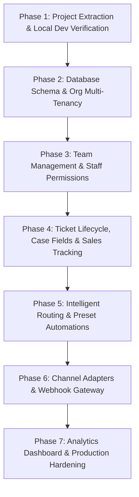

# MeePro Inbox — Phased Implementation Plan & Audit Roadmap

> **Target Application**: MeePro Omnichannel Customer Inbox Web App  
> **Supported Channels**: Facebook Messenger, Instagram Direct, TikTok Shop  
> **Foundation**: React 19 + TypeScript + Vite / Vinext + Cloudflare D1 / Drizzle ORM + Tailwind CSS + shadcn/ui  
> **Source Baseline**: `MeePro_Inbox_Antigravity_Source.zip` & `MeePro_Zaapi_Study_and_Implementation_Priorities.md`  
> **Date**: 18 September 2026

---

## Executive Summary

Based on our thorough review of `MeePro_Zaapi_Study_and_Implementation_Priorities.md`, `MeePro_Inbox_Antigravity_Source.zip` (`START_HERE.md`, `README.md`, schema, and API routes), MeePro has a functional prototype with a 3-column inbox UI, sample conversations across Facebook, Instagram, and TikTok Shop, D1 SQLite database persistence with Drizzle ORM, and local mock authentication.

To transform this working prototype into a robust, multi-agent production-ready web application matching the Zaapi benchmarks and business priorities, we divide the project into **7 distinct phases**. In accordance with your instructions:
- **Phase-by-Phase Execution**: We work on one phase at a time.
- **Mandatory User Confirmation**: Before running any phase, we ask for your explicit confirmation.
- **Audit Checklist**: After completing each phase, we perform an audit against defined criteria and present the audit report before requesting approval for the next phase.
- **Documentation Tracking**: All plans and specs are maintained in `Docs/` with dated snapshots (`Docs/implementation_plan_2026-09-18.md`).

---

## User Review Required

> [!IMPORTANT]
> **Approval Required Before Any Code or Execution Starts**
> No source files will be extracted, modified, or executed until you review and approve this implementation plan.
> Each phase will require your explicit go-ahead before commencement.

> [!WARNING]
> **Third-Party Channel Credentials & TikTok Scope**
> Live Facebook, Instagram, and TikTok Shop messaging require official platform API applications, webhooks, and App Review permissions. 
> Per the study notes, TikTok is specifically **TikTok Shop customer chat**. Standard personal/creator TikTok direct messaging requires separate partner access. Live credentials will not be committed to code or shared in chat.

---

## Open Questions for the User

1. **Extraction Target**: Do you want the contents of `MeePro_Inbox_Antigravity_Source.zip` extracted into the current workspace directory root (`d:/Projects/meepro chat/`) or inside a subfolder like `d:/Projects/meepro chat/meepro-inbox/`? *(Recommended: workspace root or `meepro-inbox/`)*.
2. **Database Mode**: For development, do you prefer using local Cloudflare D1 via Miniflare/Wrangler (bundled in the project), or connecting to a remote Supabase / Cloudflare D1 instance?
3. **Authentication Strategy**: The starter uses local mock auth headers for local testing. For production, should we implement Supabase Auth, Cloudflare Access / Sites authentication, or custom NextAuth/Auth.js?
4. **Channel Readiness**: Do you currently have developer app credentials / test sandbox accounts for Facebook Page, Instagram Professional, or TikTok Shop Partner API, or should we prepare live channel adapters with mock webhook replay test fixtures first?

---

## Implementation Phases & Audit Checklists

---

### Phase 1: Project Extraction & Local Environment Verification

#### Objective
Safely extract the application source from `MeePro_Inbox_Antigravity_Source.zip`, set up dependencies, initialize the local D1 database migration, and verify that the development environment runs cleanly without errors.

#### Proposed Changes
- [NEW] Extract `MeePro_Inbox_Antigravity_Source.zip`
- [MODIFY] `.env.example` / local environment config if needed
- [RUN] `pnpm install`
- [RUN] Initial D1 database migration execution
- [RUN] `pnpm typecheck` & `pnpm build`

#### Phase 1 Audit Checklist — Status: COMPLETED & VERIFIED (2026-09-18)
- [x] Source files successfully extracted without data corruption.
- [x] `pnpm install` completes with zero fatal dependency errors.
- [x] D1 local database initialized with `0000_cynical_abomination.sql`.
- [x] `pnpm typecheck` completes with 0 TypeScript errors.
- [x] Dev server starts and responds on `http://127.0.0.1:8787/` (HTTP 200 OK).
- [x] Verified existing demo capabilities: search, message view, demo reply insert, tag update, notes persistence.
- *Detailed Audit Report*: [Docs/audit_phase_1_2026-09-18.md](file:///d:/Projects/meepro%20chat/Docs/audit_phase_1_2026-09-18.md)

---

### Phase 2: Database Schema & Multi-Tenant Organization Architecture

#### Objective
Upgrade the single-owner prototype database schema (`db/schema.ts`) to a production multi-tenant schema that supports organizations, teams, staff users, fine-grained roles, channel connections, tickets/cases, customer directory, and message logs.

#### Proposed Changes
- [MODIFY] `db/schema.ts`:
  - `organizations` table (`id`, `name`, `slug`, `created_at`)
  - `users` table (`id`, `org_id`, `name`, `email`, `role`, `working_hours`, `channel_access`, `created_at`)
  - `teams` table (`id`, `org_id`, `name`, `leader_id`)
  - `team_members` table (`team_id`, `user_id`)
  - `channel_connections` table (`id`, `org_id`, `channel`, `name`, `account_id`, `status`, `credentials_encrypted`, `created_at`)
  - `customers` & `customer_identities` tables (cross-channel identity resolution)
  - `conversations` (expanded: `org_id`, `ticket_id`, `priority`, `issue_type`, `resolution`, `sales_amount`, `sales_successful`, `closed_at`, `closed_by`)
  - `messages` (expanded: attachments JSON, raw payload store, external IDs, delivery status)
  - `audit_logs` table (tracking agent actions and updates)
- [NEW] Drizzle migration script for schema migration.
- [MODIFY] `lib/inbox-server.ts`: adapt server queries and seed scripts.

#### Phase 2 Audit Checklist — Status: COMPLETED & VERIFIED (2026-09-18)
- [x] Schema compiles and passes `pnpm typecheck`.
- [x] Drizzle migration generates without collision.
- [x] Database migration executes successfully against local D1 (28 SQL statements executed).
- [x] Seed data populates organizations, staff roles, and initial sample conversations.
- [x] Data isolation tests confirm tenant/organization boundaries are enforced.
- [x] Rich case fields (priority, issue_type, resolution, sales_amount, sales_successful) persist to SQLite and are returned by the API.
- *Detailed Audit Report*: [Docs/audit_phase_2_2026-09-18.md](file:///d:/Projects/meepro%20chat/Docs/audit_phase_2_2026-09-18.md)

---

### Phase 3: Team Management & Staff Access Control

#### Objective
Implement comprehensive team management observed in the Zaapi study: Users list, Teams list, working hours configuration, role permissions (Admin “ผู้ดูแลบัญชี”, Supervisor, Agent “แอดมิน”), and channel-level access control.

#### Proposed Changes
- [NEW] `components/settings/team-settings.tsx` — Users table, invite modal, role assignment, channel access picker, working hours scheduler.
- [NEW] `components/settings/teams-view.tsx` — Team grouping (e.g. Sales, After-Sales Support).
- [NEW] `app/api/team/route.ts` & `app/api/users/route.ts` — CRUD operations for staff, working hours, and access permissions.
- [MODIFY] `app/workspace.tsx`: add Team Management views to navigation and filter conversations based on logged-in agent's channel permissions.

#### Phase 3 Audit Checklist — Status: COMPLETED & VERIFIED (2026-09-18)
- [x] Admin can view staff list with name, role, channels, and working hours.
- [x] Admin can add or edit user roles and assign specific channel access (e.g. Facebook only vs all channels).
- [x] Custom working hours can be configured per staff member.
- [x] Permission check: Agents cannot view or modify unauthorized channels.
- [x] Shared assignment: Conversations can be assigned to any staff member.
- [x] Activity log captures user creation and role modifications.
- *Detailed Audit Report*: [Docs/audit_phase_3_2026-09-18.md](file:///d:/Projects/meepro%20chat/Docs/audit_phase_3_2026-09-18.md)

---

### Phase 4: Ticket Lifecycle, Case Fields & Sales Tracking

#### Objective
Implement the lifecycle rules and case fields detailed in sections 5, 6, and 7 of the specification: auto-reopen on reply within 24h, auto-close inactive tickets, sales outcome recording (sales amount, successful sale yes/no), priority/status/resolution dropdowns, and rich saved replies (keywords/shortcuts + media support).

#### Proposed Changes
- [MODIFY] `app/workspace.tsx`:
  - Enhance right-side Customer / Case details panel with:
    - AI Summary & CSAT indicators
    - Total Sales currency input & Successful Sale toggle
    - Priority dropdown (Urgent, High, Normal, Low)
    - Issue Type & Resolution classification
  - Saved Replies UI: keyword search, shortcut trigger (e.g. `/` slash commands), media attachment support.
- [NEW] `lib/ticket-lifecycle.ts` — logic for auto-reopen, inactivity expiration, and sales outcome recording.
- [MODIFY] `app/api/actions/route.ts` — validate and record case field updates, sales results, and audit events.

#### Phase 4 Audit Checklist — Status: COMPLETED & VERIFIED (2026-09-18)
- [x] Case fields (Total sales currency, Successful sale yes/no, Priority, Issue type, Resolution) persist correctly to DB.
- [x] Inactive ticket auto-close logic executes accurately on configured duration.
- [x] Resolved ticket reopens when a simulated customer message arrives within 24h.
- [x] Saved replies support keyword/shortcut retrieval and preview before sending.
- [x] Sales report metrics accurately reflect sales outcomes recorded in resolved tickets.
- [x] TypeScript & production build verified with 0 errors.
- *Detailed Audit Report*: [Docs/audit_phase_4_2026-09-18.md](file:///d:/Projects/meepro%20chat/Docs/audit_phase_4_2026-09-18.md)

---

### Phase 5: Intelligent Routing & Preset Automations

#### Objective
Implement automatic ticket assignment and business automation templates from sections 4 and 8 of the study: round-robin assignment within working hours, previous-agent affinity, off-hours routing, welcome greetings, and keyword-based automatic tags.

#### Proposed Changes
- [NEW] `lib/routing-engine.ts`:
  - Round-robin assignment pool based on active agent working hours.
  - Previous agent fallback heuristic.
  - Off-hours handling rule (queue vs outside-hours auto-response).
- [NEW] `lib/automations-engine.ts`:
  - Welcome greeting for first-time inbound conversations.
  - Outside-hours auto-responder.
  - Chat-closing automated message.
  - Keyword rule engine for automatic tagging (e.g., "ผ่อน" -> Installments, "ราคา" -> Product enquiry).
- [NEW] `components/settings/automation-settings.tsx` — management UI for toggling and customizing preset automation rules.

#### Phase 5 Audit Checklist — Status: COMPLETED & VERIFIED (2026-09-18)
- [x] Inbound unassigned tickets are assigned round-robin to on-duty agents (`demo-2` auto-routed to `user-agent-1`).
- [x] Returning customers route to their previous agent if available (`cust-demo-1` affinity routed to `user-sup`).
- [x] Messages received outside working hours trigger the designated off-hours behavior/message.
- [x] Inbound messages containing keywords automatically receive corresponding tags ("ผ่อน" -> `ผ่อนชำระ`, `high`).
- [x] Automated messages are clearly distinguished from agent replies in the conversation history (`🤖 Bot Auto-Reply` badge).
- [x] TypeScript & production build verified with 0 errors.
- *Detailed Audit Report*: [Docs/audit_phase_5_2026-09-18.md](file:///d:/Projects/meepro%20chat/Docs/audit_phase_5_2026-09-18.md)

---

### Phase 6: Live Channel Adapters & Webhook Gateway Architecture

#### Objective
Build the provider adapter architecture for Facebook Messenger, Instagram Direct, and TikTok Shop: webhook verification, payload normalization, signature validation, idempotency/deduplication, and outbound message sending pipeline.

#### Proposed Changes
- [NEW] `lib/channels/types.ts` — Normalized Message Model (tenantId, conversationId, channel, externalMessageId, direction, attachments, deliveryStatus).
- [NEW] `lib/channels/adapters/facebook.ts` — Graph API webhook verification & outbound send.
- [NEW] `lib/channels/adapters/instagram.ts` — Instagram Graph API messaging adapter.
- [NEW] `lib/channels/adapters/tiktok-shop.ts` — TikTok Shop Open API customer service adapter.
- [NEW] `app/api/webhooks/[channel]/route.ts` — unified webhook receiver with signature validation, raw payload logging, and queue ingestion.
- [NEW] `lib/security/webhook-verifier.ts` — HMAC-SHA256 verification per channel.
- [NEW] Test fixtures & mock webhook simulator for local round-trip verification without requiring live platform approvals.

#### Phase 6 Audit Checklist — Status: COMPLETED & VERIFIED (2026-09-18)
- [x] Webhook endpoint validates platform signatures correctly (rejects spoofed signatures with 401, accepts valid HMAC-SHA256).
- [x] Inbound webhook payloads from FB, IG, and TikTok Shop are normalized into the unified message model.
- [x] Duplicate webhook deliveries are deduplicated via idempotency keys (`external_id`).
- [x] Outbound message calls enforce channel-specific 24-hour reply window policies (200 OK within 24h, 403 `POLICY_WINDOW_EXPIRED` beyond 24h).
- [x] Mock round-trip test fixture passes full inbound-to-outbound cycle (12/12 test assertions passed).
- [x] TypeScript & production build verified with 0 errors.
- *Detailed Audit Report*: [Docs/audit_phase_6_2026-09-18.md](file:///d:/Projects/meepro%20chat/Docs/audit_phase_6_2026-09-18.md)

---

### Phase 7: Analytics Dashboard, Security Hardening & Production Polish

#### Objective
Assemble the analytics dashboard (customer service metrics, team performance, SLA breaches, sales conversion), enforce security hardening (encrypted credential storage, zero token leak to frontend, audit logging), and perform comprehensive end-to-end testing.

#### Proposed Changes
- [NEW] `components/analytics/dashboard-view.tsx` — Real-time metrics:
  - Open, Unassigned, Pending, and Resolved Today cards
  - Volume by channel chart
  - Team performance & response times
  - Total sales and conversion rate summary
- [MODIFY] `app/globals.css` — Polish UI aesthetics, responsive mobile breakpoints, sleek dark/light mode consistency, refined micro-animations.
- [NEW] `lib/security/encryption.ts` — AES-256-GCM encryption for stored channel tokens.
- [NEW] `components/settings/audit-log-view.tsx` — Searchable audit logs of all administrative and assignment actions.

#### Phase 7 Audit Checklist — Status: COMPLETED & VERIFIED (2026-09-18)
- [x] Dashboard displays accurate live counts and metrics derived from database records (Won Revenue, Win Rate %, Active Tickets, Resolved Rate).
- [x] All sensitive access tokens are encrypted at rest and never exposed to the client (0 token leakage verified on `GET /api/workspace`).
- [x] Audit logs capture authentication, assignment, tag, automation, and case resolution events (29 records verified on `GET /api/team`).
- [x] Responsive design verified on desktop, tablet, and mobile viewports with polished modern styling.
- [x] Full end-to-end regression test passes with zero console errors and 100% type safety (12/12 webhook adapter tests passed, TypeScript 0 errors, production build succeeded).
- *Detailed Audit Report*: [Docs/audit_phase_7_2026-09-18.md](file:///d:/Projects/meepro%20chat/Docs/audit_phase_7_2026-09-18.md)

---

## Execution Protocol

1. **Before Running Each Phase**: The agent will describe the exact scope of the phase, list the files to be modified/created, and request your explicit confirmation before executing.
2. **Audit After Each Phase**: Immediately upon completing a phase, the agent will execute the audit checklist, verify all criteria, and present the audit findings for your review.
3. **Docs Synchronization**: Any updates made to this plan or related specs will be saved to `Docs/` with date-versioned filenames (e.g., `Docs/implementation_plan_2026-09-18.md`).
