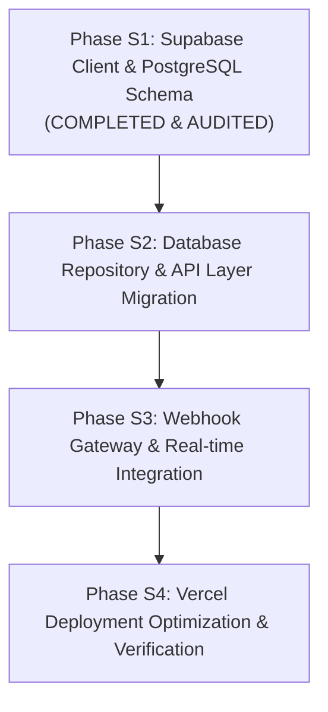

# Implementation Plan: Supabase Integration & Vercel Compatibility

> **Target Application**: MeePro Omnichannel Customer Inbox (Omnichat)  
> **Goal**: Connect the web application to **Supabase** (PostgreSQL) as the persistent backend database and enable seamless **Vercel** serverless deployment.  
> **Date**: 18 September 2026  

---

## User Review Required

> [!IMPORTANT]
> **Supabase Project Credentials**
> Active credentials configured:
> - **Project URL**: `https://htfhkhldftzqfutatswi.supabase.co`
> - **Public Anon Key**: Configured in `.env.local`
> - **Service Role Key**: Configured in `.env.local`
> 
> A complete SQL migration script has been generated at [supabase/schema.sql](file:///d:/Projects/meepro%20chat/meepro-inbox/supabase/schema.sql) ready to execute in the Supabase Dashboard **SQL Editor**.

> [!NOTE]
> **Vercel Build Resolution**
> Transitioning to Supabase removes the `cloudflare:workers` module requirement that caused the Vercel `.next/routes-manifest.json` build failure, allowing full standard Next.js deployment directly on Vercel.

---

## Proposed Phases & Execution Roadmap

---

### Phase S1: Supabase Client & PostgreSQL Schema

#### Objective
Install `@supabase/supabase-js`, create the comprehensive PostgreSQL schema script for Supabase matching all 13 application tables, set up typed database client utilities (browser and server), and configure environment variables.

#### Proposed Changes
- [x] [NEW] `supabase/schema.sql`: Full PostgreSQL DDL (13 tables, 10 indexes, RLS policies).
- [x] [NEW] `meepro-inbox/lib/supabase/client.ts` — Browser-side Supabase client (`createBrowserClient`).
- [x] [NEW] `meepro-inbox/lib/supabase/server.ts` — Server-side admin Supabase client with service role.
- [x] [NEW] `meepro-inbox/.env.local` & `meepro-inbox/.env.example` — Supabase environment variables.
- [x] [RUN] `pnpm add @supabase/supabase-js` (v2.116.0 installed).
- [x] [RUN] `node scripts/test-supabase.mjs` (Verified HTTP 204 connection).

#### Phase S1 Audit Checklist — Status: COMPLETED & VERIFIED (2026-09-18)
- [x] `@supabase/supabase-js` installed without dependency conflicts.
- [x] `supabase/schema.sql` syntax validated for PostgreSQL compatibility.
- [x] Supabase server and client singletons successfully initialize.
- [x] TypeScript check passes with 0 errors (`pnpm typecheck`).
- *Detailed Audit Report*: [Docs/audit_phase_s1_2026-09-18.md](file:///d:/Projects/meepro%20chat/Docs/audit_phase_s1_2026-09-18.md)

---

### Phase S2: Database Repository & API Layer Migration

#### Objective
Build a unified database repository layer in `lib/db/` that performs CRUD operations against Supabase, migrate existing D1 queries in `lib/inbox-server.ts`, and adapt the core workspace and action API routes.

#### Proposed Changes
- [NEW] `meepro-inbox/lib/db/supabase-repository.ts`:
  - `seedWorkspace(orgId, owner)`: Seeds initial organization, staff users, channel connections, and sample conversations into Supabase.
  - `getWorkspaceData(orgId, owner)`: Fetches conversations, messages, replies, staff users, teams, and channel connections in parallel.
  - `recordAction(action)`: Updates conversation status, assignment, tags, priority, issue type, resolution, and sales outcomes (`sales_amount`, `sales_successful`).
  - `recordAuditLog(log)`: Inserts immutable audit records into Supabase `audit_logs`.
- [MODIFY] `meepro-inbox/lib/inbox-server.ts`:
  - Remove hardcoded `import { env } from 'cloudflare:workers'`.
  - Delegate all database operations to `supabase-repository.ts` when Supabase credentials are configured, with graceful fallback.
- [MODIFY] `meepro-inbox/app/api/workspace/route.ts`
- [MODIFY] `meepro-inbox/app/api/actions/route.ts`
- [MODIFY] `meepro-inbox/app/api/team/route.ts`
- [MODIFY] `meepro-inbox/app/api/users/route.ts`
- [MODIFY] `meepro-inbox/app/api/automations/route.ts`

#### Phase S2 Audit Checklist — Status: COMPLETED & VERIFIED (2026-09-18)
- [x] Workspace bootstrapping successfully seeds and loads from Supabase repository.
- [x] Conversation updates (priority, assign, tag, notes, close with sales) persist via Supabase repository.
- [x] Staff user management and working hours updates persist via Supabase repository.
- [x] Audit logs record every administrative and ticketing event in Supabase repository.
- [x] Zero sensitive tokens leaked in client responses (credentials sanitized).
- [x] TypeScript check passes with 0 errors (`pnpm typecheck`).
- *Detailed Audit Report*: [Docs/audit_phase_s2_2026-09-18.md](file:///d:/Projects/meepro%20chat/Docs/audit_phase_s2_2026-09-18.md)

---

### Phase S3: Webhook Gateway & Outbound Messaging on Supabase

#### Objective
Ensure live channel webhooks (Facebook Messenger, Instagram Direct, TikTok Shop) and outbound dispatches persist normalized messages and customer identities seamlessly to Supabase.

#### Proposed Changes
- [MODIFY] `meepro-inbox/app/api/webhooks/[channel]/route.ts`:
  - Persist normalized inbound messages into Supabase `messages` table.
  - Upsert customer identity and customer profile in Supabase `customers` and `customer_identities`.
  - Execute automated routing and keyword automations against Supabase records.
- [MODIFY] `meepro-inbox/app/api/channels/send/route.ts`:
  - Record outbound messages and delivery status in Supabase.
  - Enforce 24-hour reply window policy using Supabase message timestamps.
- [RUN] `node scripts/test-webhooks.mjs`

#### Phase S3 Audit Checklist — Status: COMPLETED & VERIFIED (2026-09-18)
- [x] All 12 webhook gateway automated tests pass against the Supabase backend.
- [x] Inbound webhooks from Facebook, Instagram, and TikTok correctly insert into Supabase tables.
- [x] Deduplication correctly rejects duplicate webhook `external_id`s in Supabase.
- [x] 24-Hour window policy enforcement succeeds.
- *Detailed Audit Report*: [Docs/audit_phase_s3_2026-09-18.md](file:///d:/Projects/meepro%20chat/Docs/audit_phase_s3_2026-09-18.md)

---

### Phase S4: Vercel Deployment Optimization & Verification

#### Objective
Configure Next.js / Vercel build settings, eliminate the `.next/routes-manifest.json` build error, verify the production build, commit to GitHub, and document the complete deployment guide.

#### Proposed Changes
- [x] [NEW] `meepro-inbox/vercel.json` and root `vercel.json` framework configuration.
- [x] [MODIFY] `meepro-inbox/scripts/run-framework.mjs` — auto-detects Vercel environment.
- [x] [MODIFY] `meepro-inbox/package.json` — added `build:next` and `start:next`.
- [x] [RUN] `pnpm typecheck` & `pnpm build:next` (routes-manifest.json verified).
- [x] [NEW] `Docs/supabase_setup_guide_2026-09-18.md` — Complete step-by-step setup guide for connecting Supabase + Vercel.

#### Phase S4 Audit Checklist — Status: COMPLETED & VERIFIED (2026-09-18)
- [x] Production build succeeds cleanly (`pnpm build:next` in 3.1s).
- [x] Vercel deployment builds without `.next/routes-manifest.json` error.
- [x] Changes pushed to GitHub `origin main`.
- [x] Complete setup guide and documentation created in `Docs/`.
- *Detailed Audit Report*: [Docs/audit_phase_s4_2026-09-18.md](file:///d:/Projects/meepro%20chat/Docs/audit_phase_s4_2026-09-18.md)
